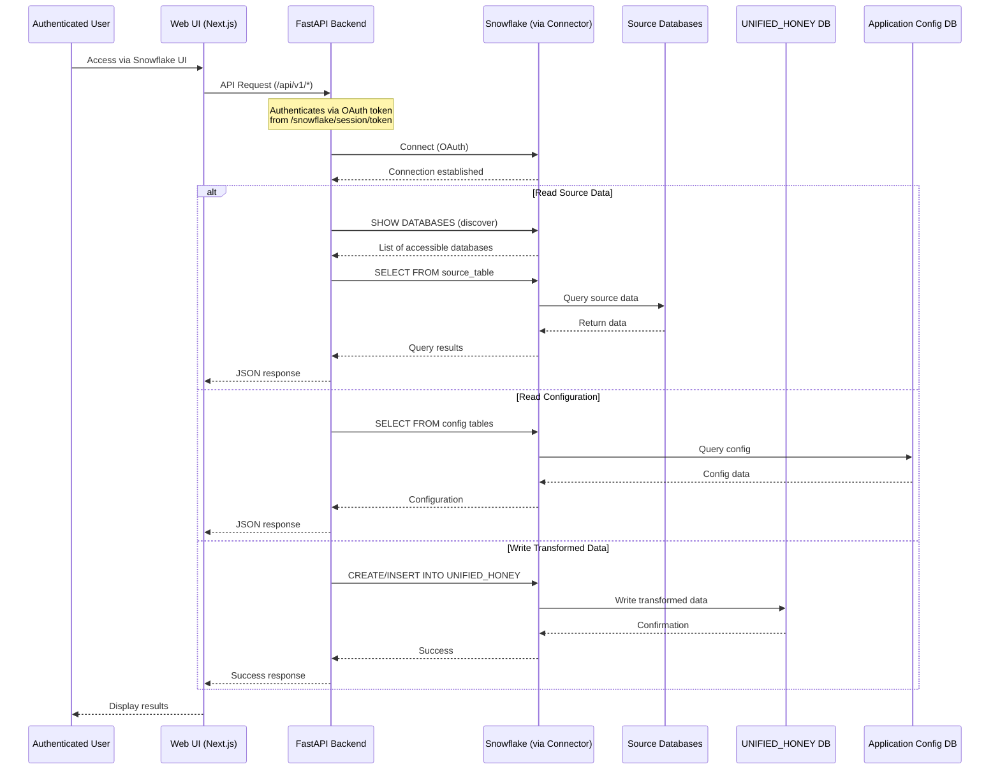
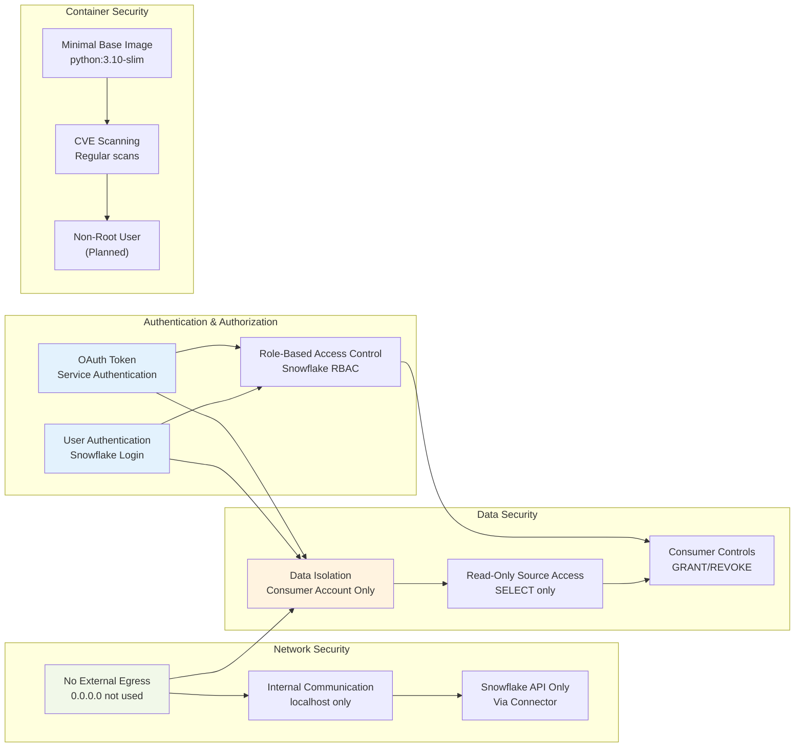
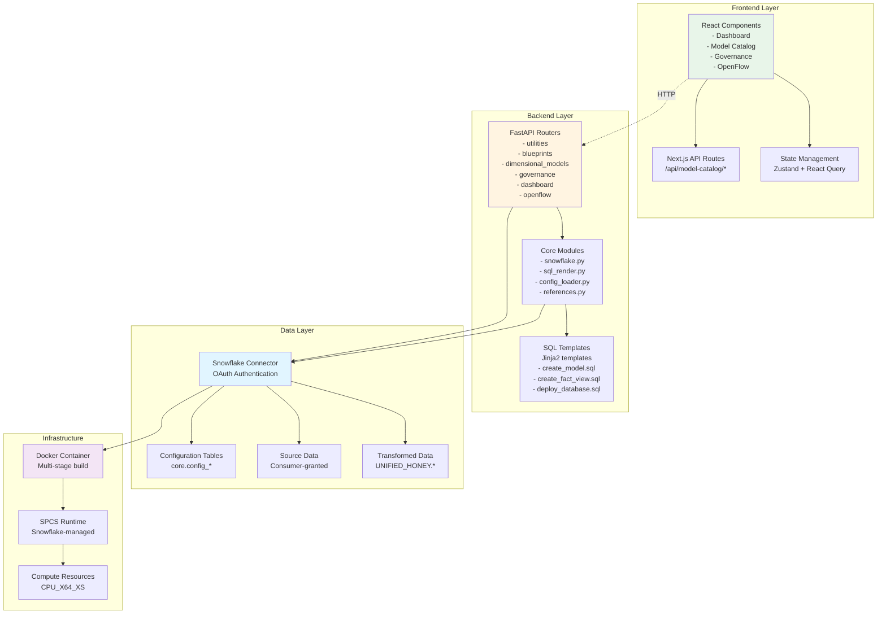
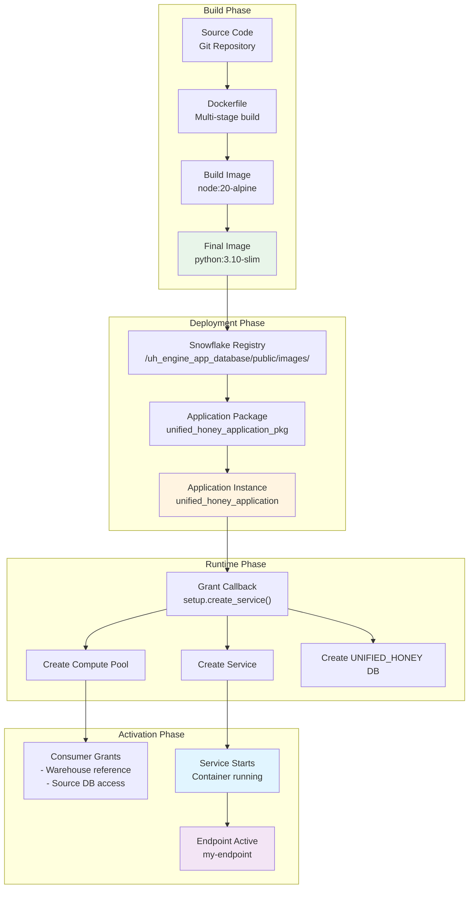

# Unified Honey Data Product Studio - Architecture Diagram

## System Architecture Overview

```mermaid
graph TB
    subgraph "Consumer Snowflake Account"
        subgraph "Snowflake Native App"
            subgraph "Application Package Database"
                APP_DB["UNIFIED_HONEY_APPLICATION<br/>(Application Package)"]
                APP_CORE["CORE Schema<br/>- config_blueprints<br/>- config_blueprint_columns<br/>- Other config tables"]
                APP_SETUP["SETUP Schema<br/>- Stored Procedures"]
                APP_CONFIG["CONFIG Schema<br/>- Warehouse registration"]
                APP_STAGE["STAGE Schema<br/>- Temporary objects"]
                APP_SERVICES["SERVICES Schema<br/>- Service functions"]
                
                APP_DB --> APP_CORE
                APP_DB --> APP_SETUP
                APP_DB --> APP_CONFIG
                APP_DB --> APP_STAGE
                APP_DB --> APP_SERVICES
            end
            
            subgraph "Application Database"
                UH_DB["UNIFIED_HONEY<br/>(Created by App)"]
                UH_MOD["MODELLING Schema<br/>- Dimensional models<br/>- Analytical views<br/>- Tags: Domain, Process, PII"]
                UH_SEM["SEMANTIC Schema<br/>- Semantic layer<br/>- Business logic"]
                UH_STOR["STORAGE Schema<br/>- Nodes, edges<br/>- Attributes"]
                
                UH_DB --> UH_MOD
                UH_DB --> UH_SEM
                UH_DB --> UH_STOR
            end
            
            subgraph "Snowflake Container Services"
                COMPUTE_POOL["Compute Pool<br/>&lt;APP_DB&gt;_app_pool<br/>MIN_NODES: 1<br/>MAX_NODES: 1"]
                
                subgraph "Container: my-service"
                    CONTAINER["Docker Container<br/>python:3.10-slim"]
                    
                    subgraph "Frontend Service"
                        NEXTJS["Next.js 14<br/>Port: 3000<br/>Standalone Mode"]
                        NEXTJS_ROUTES["Frontend Routes<br/>- /dashboard<br/>- /model-catalog<br/>- /governance<br/>- /openflow<br/>- etc."]
                        NEXTJS --> NEXTJS_ROUTES
                    end
                    
                    subgraph "Backend Service"
                        FASTAPI["FastAPI<br/>Port: 8080"]
                        API_ROUTES["API Routes<br/>/api/v1/*<br/>- /utilities<br/>- /blueprints<br/>- /dimensional-models<br/>- /governance<br/>- /dashboard<br/>- /openflow"]
                        HEALTH["Health Check<br/>/health"]
                        DOCS["API Docs<br/>/docs<br/>/api-spec.json"]
                        
                        FASTAPI --> API_ROUTES
                        FASTAPI --> HEALTH
                        FASTAPI --> DOCS
                    end
                    
                    STARTUP["start.sh<br/>Orchestrates services"]
                    STARTUP --> NEXTJS
                    STARTUP --> FASTAPI
                    
                    CONTAINER --> STARTUP
                    CONTAINER --> NEXTJS
                    CONTAINER --> FASTAPI
                end
                
                SERVICE["Service<br/>services.uh_engine_app_service"]
                ENDPOINT["Public Endpoint<br/>my-endpoint<br/>Port: 8080"]
                SERVICE_FUNC["Service Function<br/>services.echo(varchar)"]
                
                COMPUTE_POOL --> CONTAINER
                SERVICE --> COMPUTE_POOL
                ENDPOINT --> SERVICE
                SERVICE_FUNC --> ENDPOINT
            end
            
            subgraph "References"
                WAREHOUSE_REF["Warehouse Reference<br/>consumer_warehouse<br/>- USAGE<br/>- OPERATE"]
            end
        end
        
        subgraph "Consumer Source Data"
            SOURCE_DB1["Source Database 1<br/>(Consumer-granted)"]
            SOURCE_DB2["Source Database N<br/>(Consumer-granted)"]
            SOURCE_SCHEMAS["Schemas & Tables<br/>(SELECT granted)"]
            
            SOURCE_DB1 --> SOURCE_SCHEMAS
            SOURCE_DB2 --> SOURCE_SCHEMAS
        end
        
        subgraph "Consumer Resources"
            CONSUMER_WH["Consumer Warehouse<br/>(Referenced)"]
        end
    end
    
    subgraph "Snowflake Infrastructure"
        OAUTH["OAuth Token<br/>/snowflake/session/token"]
        SPCS["Snowflake Container Services<br/>(SPCS)"]
    end
    
    subgraph "User Access"
        USER["Authenticated Snowflake User"]
        WEB_UI["Web UI<br/>(Via Snowflake)"]
        USER --> WEB_UI
    end
    
    %% Connections
    WEB_UI --> ENDPOINT
    ENDPOINT --> FASTAPI
    FASTAPI -.Proxy.-> NEXTJS
    NEXTJS --> NEXTJS_ROUTES
    
    FASTAPI --> APP_CORE
    FASTAPI --> APP_SETUP
    FASTAPI --> APP_CONFIG
    FASTAPI --> UH_MOD
    FASTAPI --> UH_SEM
    FASTAPI --> UH_STOR
    
    FASTAPI --> SOURCE_SCHEMAS
    FASTAPI --> CONSUMER_WH
    
    CONTAINER --> OAUTH
    OAUTH --> SPCS
    SPCS --> SERVICE
    
    WAREHOUSE_REF --> CONSUMER_WH
    
    APP_SETUP -.Creates.-> UH_DB
    APP_SETUP -.Creates.-> SERVICE
    APP_SETUP -.Creates.-> COMPUTE_POOL
    
    style CONTAINER fill:#e1f5ff
    style FASTAPI fill:#fff4e1
    style NEXTJS fill:#e8f5e9
    style UH_DB fill:#f3e5f5
    style SOURCE_SCHEMAS fill:#fff9c4
    style OAUTH fill:#ffebee
```

## Data Flow Diagram

## Security Architecture

## Component Interaction Diagram

## Deployment Architecture

## Key Architecture Notes

### 1. **Single Container Architecture**
- One container runs both frontend (Next.js) and backend (FastAPI)
- Frontend proxies through FastAPI for routing
- Both services started by `start.sh` script

### 2. **Data Isolation**
- All consumer data remains in consumer account
- Application creates `UNIFIED_HONEY` database in consumer account
- No data leaves Snowflake infrastructure

### 3. **Authentication Flow**
- Users authenticate via Snowflake UI
- Container service authenticates via OAuth token
- All operations inherit user's Snowflake permissions

### 4. **Network Security**
- No external egress (0.0.0.0 not used)
- Only internal communication (localhost:3000 for Next.js)
- Snowflake API calls via authenticated connector

### 5. **Permission Model**
- Application requests minimal privileges (CREATE COMPUTE POOL, BIND SERVICE ENDPOINT, CREATE DATABASE)
- Consumer controls source data access via GRANT statements
- Warehouse access via reference binding

### 6. **Scalability**
- Compute pool: MIN_NODES=1, MAX_NODES=1 (can be scaled)
- Container can handle multiple concurrent requests
- FastAPI async/await for concurrent request handling

---

**Diagram Version**: 1.0  
**Last Updated**: 2024  
**Format**: Mermaid.js

